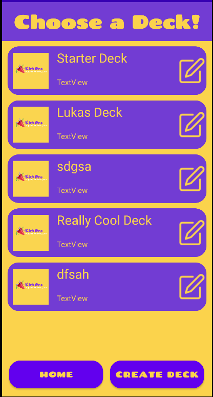
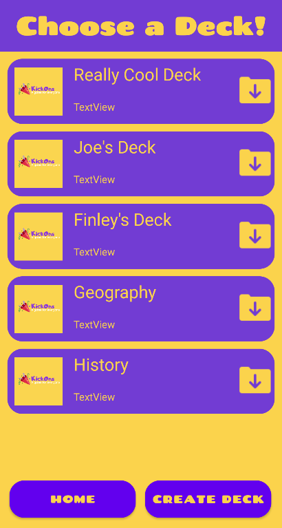
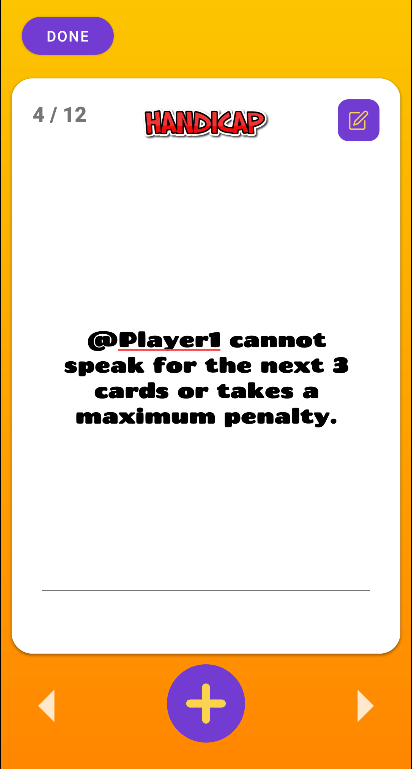

# KickOns - A game for everyone 


## Installation

To install clone the repository to your computer

```bash
git clone https://github.com/Luka-Didham/COSC345.git
```

### Usage
To run the app open android studio and create a new virtual device or upload to a physical android device running API 29+ . Once you've selected your chosen emulator press the green play button to start the app in Android studio. 

### Game
On welcome screen can either press "play" which wil take you to locally saved decks. Or you can press the "help" menu taking you to a page with gameplay information or you can press on the "online decks" which will take you to a centralised deck server where other users have uploaded decks. Once a deck is selected gameplay follows as 

1. Add at least two players and press start (Can be modified any time)
2. Select a deck or an online deck to get started or go to deck creation to create/edit your own. 
3. Move through the cards attempting to aquire the least amount of penalties and following prompts on cards.






### Deck Creation
1. After entering players select create deck
2. Enter in a name, and optionally a description
3. This will bring you to the card creation screen
4. Select a type and enter the challenge for each card
5. Placing a @ in front of the word player e.g. @player1, @player2, will insert a player from the list you have entered previously

i.e. "@player1 has to dance with @player2" -> "James has to dance Sam"

# Android CI
[](https://github.com/Luka-Didham/COSC345/actions/workflows/android.yml)
[](https://www.codacy.com/gh/Luka-Didham/COSC345/dashboard?utm_source=github.com&amp;utm_medium=referral&amp;utm_content=Luka-Didham/COSC345&amp;utm_campaign=Badge_Grade)
[](https://app.codecov.io/gh/Luka-Didham/COSC345/tree/master)
[](https://www.codacy.com/gh/Luka-Didham/COSC345/dashboard?utm_source=github.com&utm_medium=referral&utm_content=Luka-Didham/COSC345&utm_campaign=Badge_Coverage)

# Questionnaire
https://docs.google.com/forms/d/1cbFpy2ZIdCAx8iL0ZZ2GZf13UfXBPHssZNWesz-KLTU/edit#settings
